# DROPX — Limited-release sneaker storefront

Beyond a UI showcase: real authentication, PostgreSQL, inventory, and order management.

**Positioning:** *The destination for limited-release sneakers and exclusive drops.*

> Portfolio project — payment is intentionally simulated; orders, stock, and account data are real in Postgres.

<!--
  LIVE DEMO: add your Vercel URL here after deploy
  **Live:** https://your-dropx-url.vercel.app
-->

---

## Screenshots

| | |
|:--|:--|
| 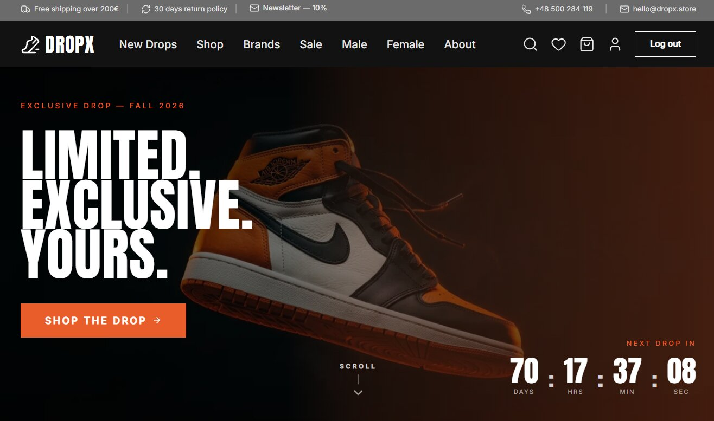 | 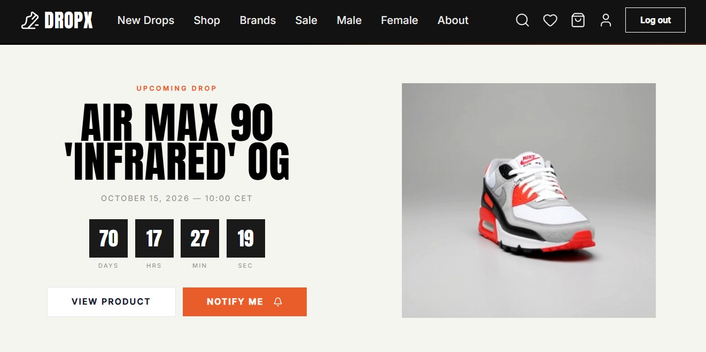 |
| *Homepage hero* | *Upcoming Drop — film + countdown* |
| 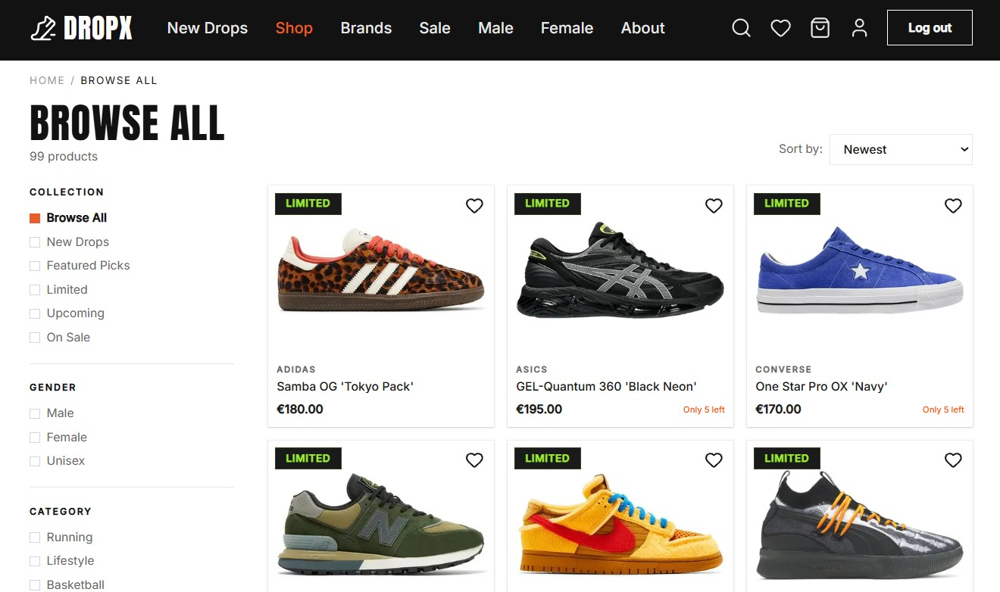 | 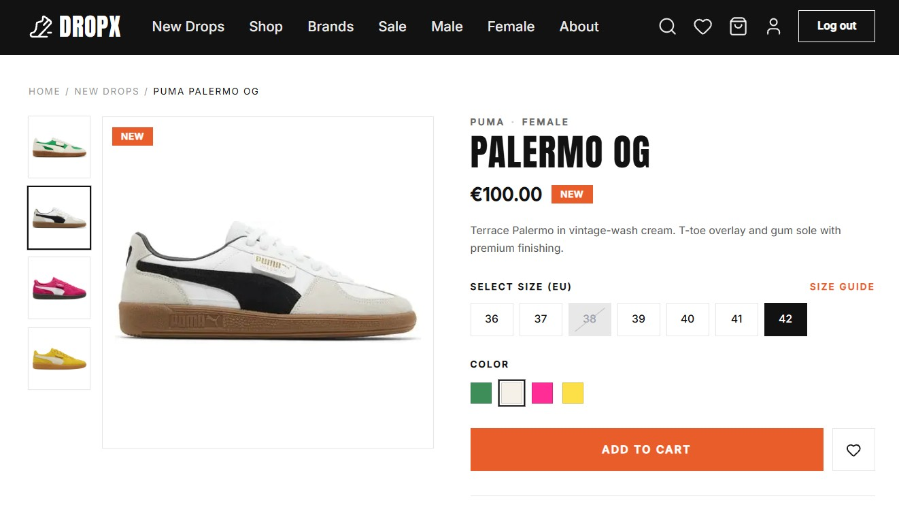 |
| *Browse All + filters* | *Product detail — color / size / stock* |
| 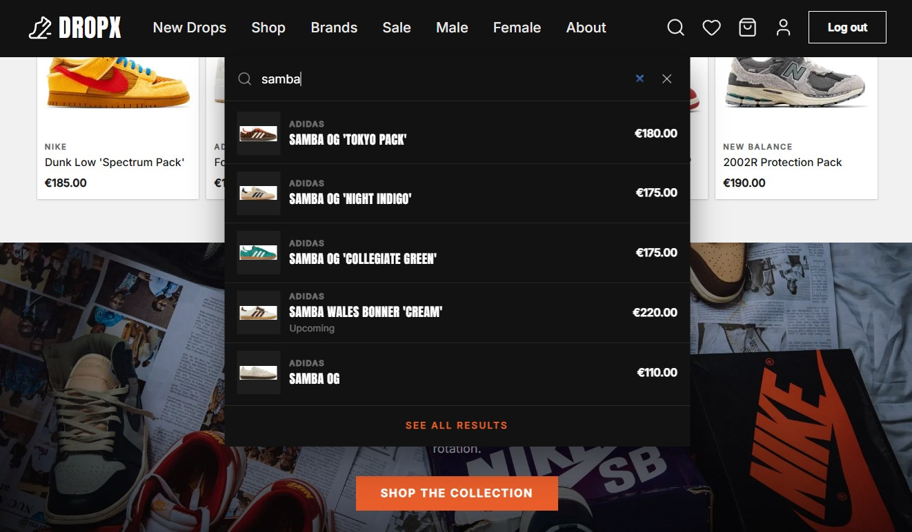 | 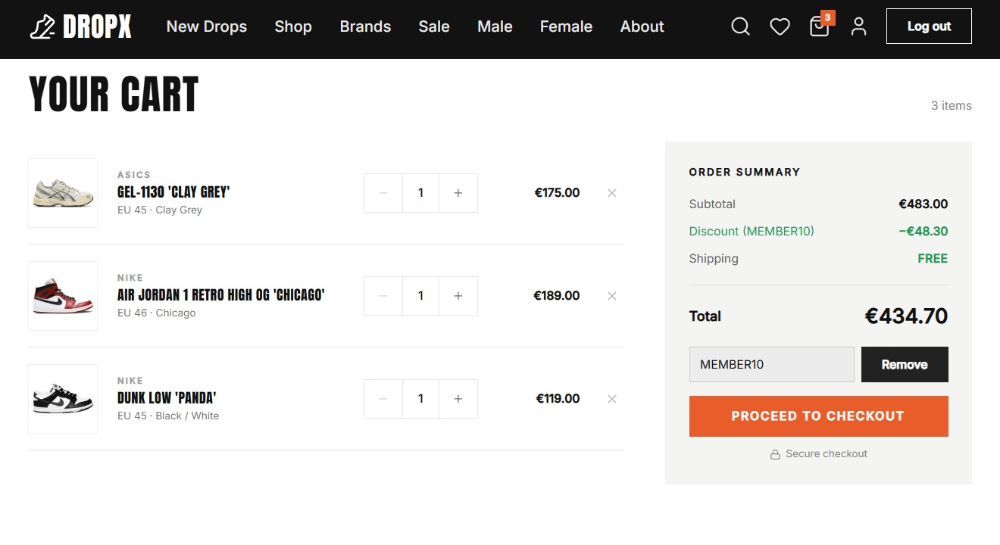 |
| *Live product search* | *Cart / checkout* |
| 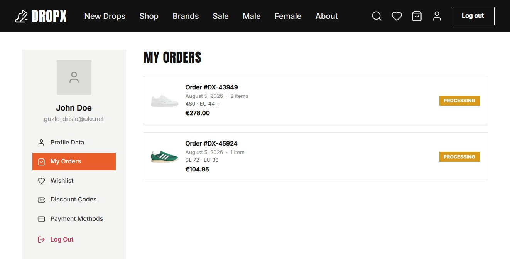 | |
| *Account orders after mock pay* | |

### Mobile (~375px)

| | |
|:--|:--|
| 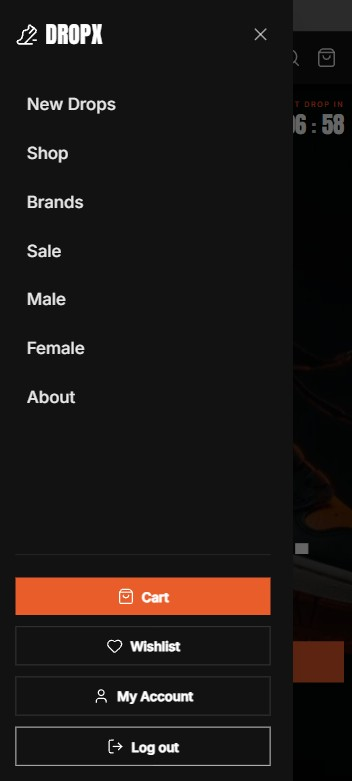 | 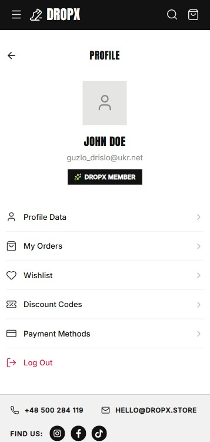 |
| *Mobile drawer* | *Account* |
| 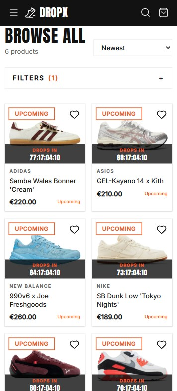 | 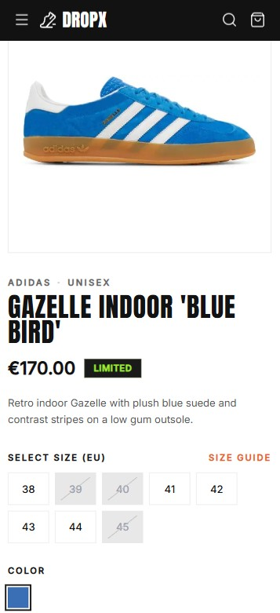 |
| *Browse* | *Product detail* |

---

## Highlights

- Full-stack Next.js application
- Real PostgreSQL database (Prisma 7)
- Auth.js credentials + JWT sessions
- URL-driven catalog filters & live search
- Server Actions for cart, checkout, profile
- Inventory-aware checkout (stock decrements on order)
- ~100 seeded products across 6 brands
- Responsive UI (desktop + mobile)
- Typed end-to-end with TypeScript
- Vitest coverage on core helpers

---

## Why this project

Built as a **product-shaped** storefront — schema → shop UX → auth-gated commerce → orders — not a component gallery.

Browse → PDP → cart → mock payment → **real order + stock write** → account history.

---

## Stack

| Layer | Choice |
|-------|--------|
| Framework | **Next.js 16** (App Router) + **React 19** |
| Language | **TypeScript** |
| Styling | **Tailwind CSS v4**, Lucide, Anton + Inter |
| ORM / DB | **Prisma 7** → **PostgreSQL** |
| Auth | **Auth.js v5** (Credentials, JWT, PrismaAdapter) |
| Forms | **Zod** + **React Hook Form** |
| Media | **Cloudinary** |
| Tests | **Vitest** |

**Next.js → Prisma → Postgres.** Postgres may be hosted on Supabase; the app talks only through Prisma.

---

## Features

### Storefront
- Marketing homepage with live product rails from the database
- Upcoming Drop campaign (countdown + product film)
- Browse All: brand, gender, category, color, size, price, sort, pagination
- Brand-mixed default grid + navbar live search

### Product detail
- Colorways, EU sizes, stock / low-stock nudges, sale badges
- Wishlist + add to cart (auth-required)
- Upcoming products gated until release time
- Related products

### Authentication
- Register / login / logout (bcrypt + JWT)
- Protected cart, checkout, and account routes
- Profile updates, change email, change password

### Checkout
- DB-backed cart, quantities, promo codes
- Multi-step flow: contact + shipping → mock payment → confirmation
- Creates orders, decrements stock, clears cart

### Account
- Order history and wishlist
- Address / contact saved from checkout or profile
- Newsletter unlocks member discount (`MEMBER10`)

---

## Demo limitations

| Area | Status |
|------|--------|
| Payment | Mock UI — no PSP / no card data |
| Password reset | Demo UI only (no email) |
| OAuth | Not wired |
| Guest cart | Auth required |
| Newsletter | DB only (no external ESP) |

---

## Getting started

Node 20+, Postgres URL, optional Cloudinary cloud name. Copy [`.env.example`](.env.example) → `.env` and fill values.

```bash
cp .env.example .env
npm install
npx prisma generate
npx prisma migrate deploy   # or: npm run db:push
npm run db:seed
npm run dev
```

Open [http://localhost:3000](http://localhost:3000).

Useful scripts: `npm run lint` · `npm run test:run` · `npm run build`

### Demo users (after seed)

| Email | Password |
|-------|----------|
| `alice@dropx.store` | `DropxSeed123!` |
| `bob@dropx.store` | `DropxSeed123!` |

---

## License

Private project — all rights reserved.
