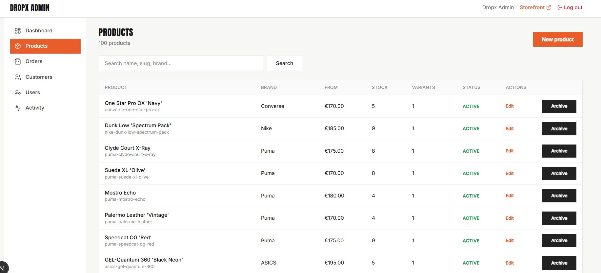

# DROPX — Limited-release sneaker storefront

Beyond a UI showcase: real authentication, PostgreSQL inventory, orders, product reviews, and an **admin panel with RBAC**.

**Positioning:** *The destination for limited-release sneakers and exclusive drops.*

> Portfolio project — payment is intentionally simulated; catalog, stock, orders, reviews, and admin data are real in Postgres.

**LIVE DEMO**: https://dropx-store.vercel.app/

---

## Screenshots

| | |
|:--|:--|
|  |  |
| *Homepage hero* | *Upcoming Drop — film + countdown* |
|  |  |
| *Browse All + filters* | *Product detail — color / size / stock* |
|  |  |
| *Live product search* | *Cart / checkout* |
|  |  |
| *Account orders after mock pay* | *Admin — products, stock, RBAC* |

### Mobile (~375px)

| | |
|:--|:--|
|  |  |
| *Mobile drawer* | *Account* |
|  |  |
| *Browse* | *Product detail* |

---

## Highlights

- Full-stack Next.js application (App Router)
- Real PostgreSQL database (Prisma 7)
- Auth.js credentials + JWT sessions
- **Admin panel** with `ADMIN` / `CUSTOMER` RBAC, product CRUD, stock, orders, activity log
- URL-driven catalog filters & multi-word live search
- Server Actions for cart, checkout, profile, reviews, admin
- Inventory-aware checkout (stock decrements on order)
- Verified-purchase product reviews (one per pair)
- ~100 seeded products across 6 brands
- Responsive UI (desktop + mobile)
- Typed end-to-end with TypeScript
- Vitest coverage on core helpers

---

## Why this project

Built as a **product-shaped** storefront — schema → shop UX → auth-gated commerce → orders → **ops admin** — not a component gallery.

Browse → PDP → cart → mock payment → **real order + stock write** → account history → (admin) fulfill / edit catalog.

---

## Stack

| Layer | Choice |
|-------|--------|
| Framework | **Next.js 16** (App Router) + **React 19** |
| Language | **TypeScript** |
| Styling | **Tailwind CSS v4**, Lucide, Anton + Inter |
| ORM / DB | **Prisma 7** → **PostgreSQL** |
| Auth | **Auth.js v5** (Credentials, JWT, PrismaAdapter) |
| Forms | **Zod** + **React Hook Form** |
| Media | **Cloudinary** |
| Tests | **Vitest** |

**Next.js → Prisma → Postgres.** Postgres may be hosted on Supabase / Prisma Postgres; the app talks only through Prisma.

---

## Features

### Storefront
- Marketing homepage with live product rails from the database
- Upcoming Drop campaign (countdown + product film)
- Browse All: brand, gender, category, color, size, price, sort, pagination
- Brand-mixed default grid + navbar live search (multi-word queries)
- Recently viewed rail (localStorage + API)

### Product detail
- Colorways, EU sizes, stock / low-stock nudges, sale badges
- Wishlist + add to cart (auth-required)
- Upcoming products gated until release time
- Related products
- Reviews: average stars, verified purchase, create / delete (eligible after delivered order)

### Authentication
- Register / login / logout (bcrypt + JWT)
- Protected cart, checkout, account, and admin routes
- Profile updates, change email, change password
- Role on user (`CUSTOMER` | `ADMIN`) baked into the session JWT

### Checkout
- DB-backed cart, quantities, promo codes
- Multi-step flow: contact + shipping → mock payment → confirmation
- Creates orders, decrements stock, clears cart
- Demo fulfillment timeline (processing → shipped → delivered) so reviews can unlock

### Account
- Order history (view product / add review when delivered)
- Wishlist, addresses / contact, newsletter member discount (`MEMBER10`)
- Admin link shown only for `ADMIN` users

### Admin panel (`/admin`)
- Dashboard: orders, revenue, customers, products, recent orders
- Products: create / edit, variants, per-size stock, archive (hidden from storefront)
- Orders: list, filter by status, manual status updates
- Customers: list + order history
- Users: promote / demote `CUSTOMER` ↔ `ADMIN` (re-login required after role change)
- Activity log: stock, price, order status, and role changes
- Gate: proxy JWT check + server `requireAdmin()` (defense in depth)

---

## Demo limitations

| Area | Status |
|------|--------|
| Payment | Mock UI — no PSP / no card data |
| Password reset | Demo UI only (no email) |
| OAuth | Not wired |
| Guest cart | Auth required |
| Newsletter | DB only (no external ESP) |
| Admin image upload | URL field only (Cloudinary IDs in seed) |
| STAFF role | Not in v1 (RBAC ready to extend) |

---

## Getting started

Node 20+, Postgres URL, optional Cloudinary cloud name. Copy [`.env.example`](.env.example) → `.env` and fill values.

```bash
cp .env.example .env
npm install
npx prisma generate
npx prisma migrate deploy   # or: npm run db:push
npm run db:seed
npm run dev
```

Open [http://localhost:3000](http://localhost:3000). Admin: [http://localhost:3000/admin](http://localhost:3000/admin).

Useful scripts: `npm run lint` · `npm run test:run` · `npm run build`

Promote any user to admin:

```bash
npx tsx scripts/promote-admin.ts you@email.com
# demote: npx tsx scripts/promote-admin.ts you@email.com --demote
```

### Demo users (after seed)

| Email | Password | Role |
|-------|----------|------|
| `admin@dropx.store` | `DropxSeed123!` | **ADMIN** |
| `alice@dropx.store` | `DropxSeed123!` | Customer |
| `bob@dropx.store` | `DropxSeed123!` | Customer |

Sign out and sign in again after a role change so the JWT picks up the new role.

---

## License

Private project — all rights reserved.
